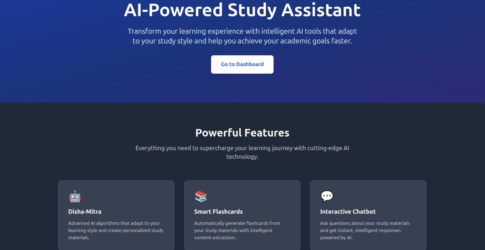
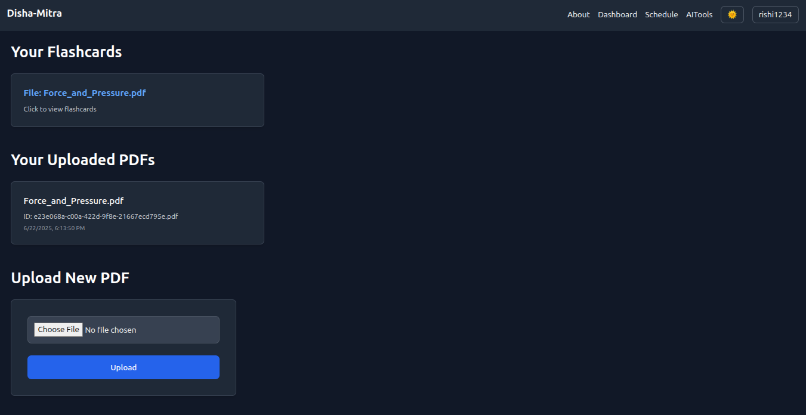
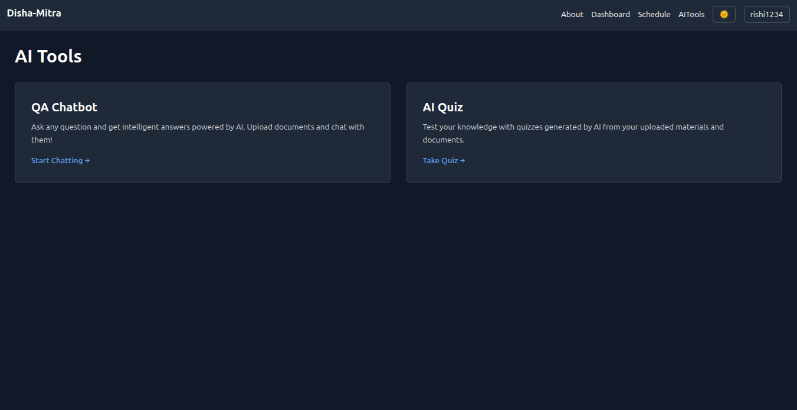
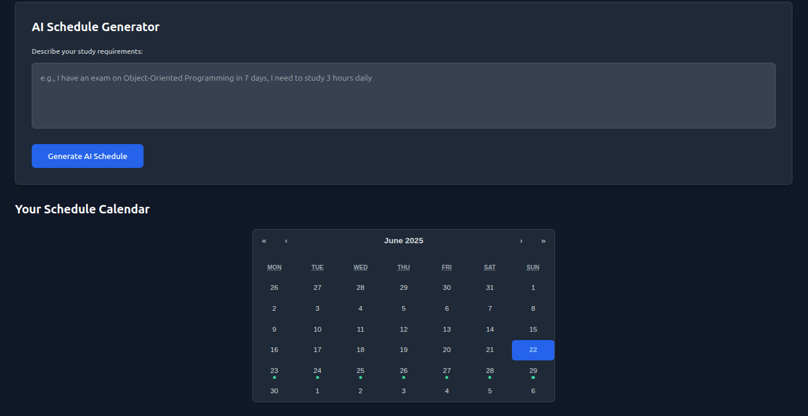
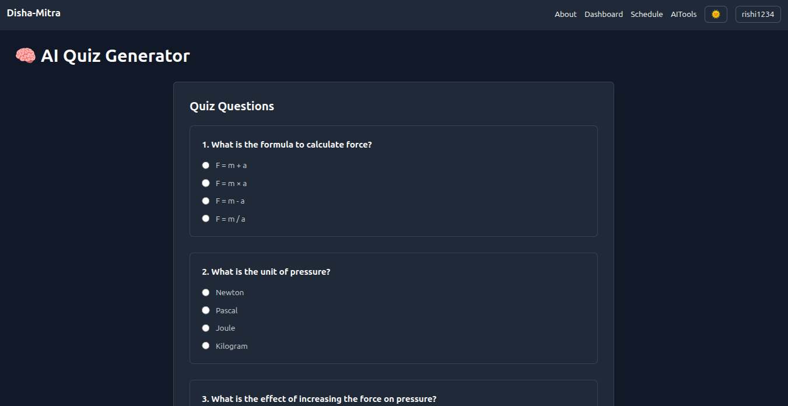
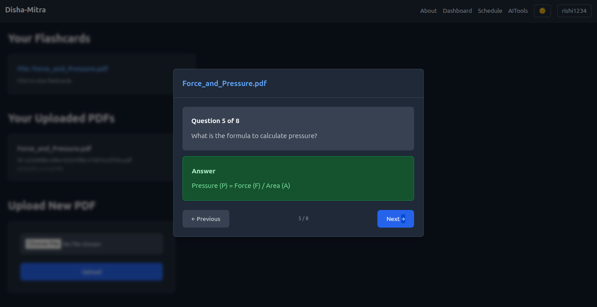
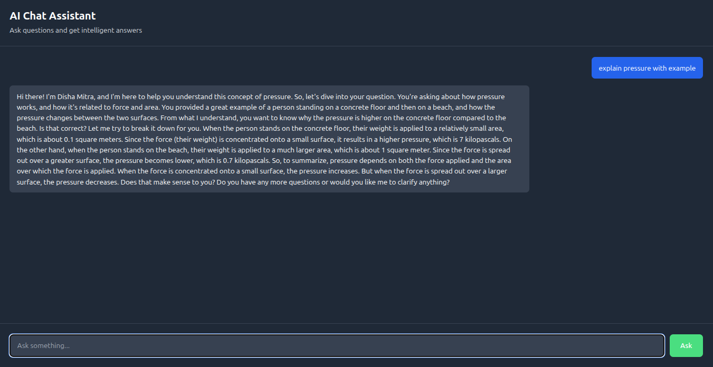
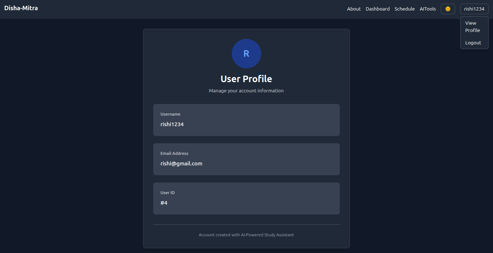

# Disha-Mitra: AI-Powered Study Assistant

A comprehensive AI-driven study platform that helps students create personalized learning experiences through intelligent content generation, smart scheduling, and interactive study tools.

## About

Disha-Mitra (meaning "Guide-Friend" in Sanskrit) is an innovative AI-powered study assistant designed to revolutionize the way students learn and prepare for their academic goals. Our platform combines cutting-edge artificial intelligence with proven educational methodologies to create a personalized learning experience that adapts to each student's unique needs.

### What Makes Disha-Mitra Special?

- **Intelligent Content Generation**: Our AI analyzes your study materials and creates personalized flashcards, quizzes, and study schedules
- **Adaptive Learning**: The system learns from your progress and adjusts content difficulty and focus areas
- **Smart Scheduling**: AI-generated study plans that optimize your time and improve retention
- **Interactive Learning**: Chat with an AI assistant that understands your study context
- **Progress Tracking**: Comprehensive analytics to monitor your learning journey

### Target Users

- **Students**: From high school to university level, preparing for exams and assignments
- **Educators**: Teachers and professors looking to create engaging study materials
- **Self-Learners**: Anyone pursuing knowledge independently with structured guidance

## Screenshots

### Landing Page

*Modern, responsive landing page showcasing the platform's features and capabilities*

### User Dashboard

*Comprehensive dashboard displaying user progress, recent activities, and quick access to all features*

### AI Tools Interface

*Centralized hub for all AI-powered features including flashcard generation, quiz creation, and chatbot access*

### Schedule Management

*Interactive calendar interface with AI-generated study schedules and progress tracking*

### Quiz Generation & Taking

*Dynamic quiz interface with AI-generated questions and real-time performance feedback*

### Flashcard Study Mode

*Interactive flashcard system with spaced repetition and progress tracking*

### Chatbot Interface

*AI-powered Q&A system for instant help with study materials*

### Profile & Settings

*User profile management with preferences, progress history, and account settings*

## Demo Video

### Full Platform Walkthrough
[](https://youtu.be/ChcZE8gRiEE)
### Link : https://youtu.be/ChcZE8gRiEE

## Features

### AI-Powered Learning
- **Smart Content Generation**: AI algorithms that adapt to your learning style
- **Personalized Study Materials**: Customized content based on your preferences
- **Intelligent Analysis**: Advanced processing of study materials

### Smart Flashcards
- **Automatic Generation**: Create flashcards from uploaded documents
- **Intelligent Extraction**: AI-powered content extraction from PDFs
- **Spaced Repetition**: Optimized learning intervals for better retention

### Interactive Chatbot
- **Q&A System**: Ask questions about your study materials
- **Instant Responses**: Get intelligent answers powered by AI
- **Context-Aware**: Understands your study context and materials

### AI Quiz Generator
- **Comprehensive Quizzes**: Generate quizzes from study materials
- **Multiple Formats**: Various question types and difficulty levels
- **Performance Tracking**: Monitor quiz results and progress

### Smart Scheduling
- **AI-Generated Schedules**: Optimized study plans based on your goals
- **Time Management**: Efficient allocation of study time
- **Progress Integration**: Schedules that adapt to your learning progress

## Tech Stack

### Frontend
- **React.js** - Modern UI framework
- **Tailwind CSS** - Utility-first CSS framework
- **React Router** - Client-side routing
- **Context API** - State management
- **React Calendar** - Schedule management

### Backend
- **Node.js** - Server runtime
- **Express.js** - Web framework
- **JWT** - Authentication
- **Multer** - File upload handling
- **CORS** - Cross-origin resource sharing

### AI Services
- **FastAPI** - Python-based AI service
- **Sentence-Transformer** - parse data from vector index
- **FAISS** - Vector index
- **GROQ API** - Advanced language models
- **PDF Processing** - Document analysis and extraction

### Database
- **SQLite** - Lightweight database (development)
- **User Management** - Custom user authentication system

## Installation

### Prerequisites
- Node.js (v16 or higher)
- Python (v3.8 or higher)
- npm or yarn

### Backend Setup

1. **Clone the repository**
   ```bash
   git clone https://github.com/yourusername/ai-powered-study-assistant.git
   cd ai-powered-study-assistant
   ```

2. **Navigate to backend directory**
   ```bash
   cd backend
   ```

3. **Install backend dependencies**
   ```bash
   npm install
   ```

4. **Set up environment variables**
   ```bash
   cp .env.example .env
   # Edit .env with your configuration
   ```

5. **Start the backend server**
   ```bash
   npm start
   ```
   
   The backend will run on `http://localhost:5000`

### GenAI Service Setup

1. **Navigate to genai service directory**
   ```bash
   cd genai
   ```

2. **Create virtual environment**
   ```bash
   python -m venv venv
   ```

3. **Activate virtual environment**
   
   **For Linux/Mac:**
   ```bash
   source venv/bin/activate
   ```
   
   **For Windows:**
   ```bash
   venv\Scripts\activate
   ```

4. **Install Python dependencies**
   ```bash
   pip install -r requirements.txt
   ```

5. **Set up environment variables**
   ```bash
   cp .env.example .env
   # Add your groq API key and other configurations
   ```

6. **Start the AI service**
   ```bash
   python main.py
   ```
   
   The GenAI service will run on `http://localhost:8000`

### Frontend Setup

1. **Navigate to frontend directory**
   ```bash
   cd frontend
   ```

2. **Install frontend dependencies**
   ```bash
   npm install
   ```

3. **Start the development server**
   ```bash
   npm start
   ```
   
   The frontend will run on `http://localhost:3000`

## Running the Application

### Step-by-Step Startup

1. **Start Backend Server**
   ```bash
   cd backend
   npm start
   ```

2. **Start GenAI Service** (in a new terminal)
   ```bash
   cd genai
   source venv/bin/activate  # Linux/Mac
   # or venv\Scripts\activate  # Windows
   python main.py
   ```

3. **Start Frontend** (in a new terminal)
   ```bash
   cd frontend
   npm start
   ```

### Service URLs

- **Frontend**: http://localhost:3000
- **Backend API**: http://localhost:5000
- **GenAI Service**: http://localhost:8000


## Configuration

### Environment Variables

#### Backend (.env)
```env
PORT=5000
JWT_SECRET=your-jwt-secret
MONGO_URI=your-mongodb-uri
```

#### AI Service (.env)
```env
GROQ_API_KEY=your-groq-api-key
HUGGING_FACE_TOKEN=huggingface-access-token
```
